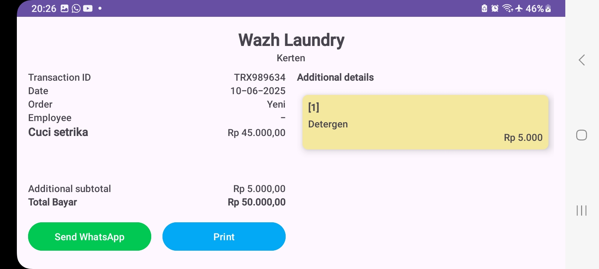

# 🧺 Aplikasi Laundry Android

Aplikasi Laundry ini dirancang untuk menyelesaikan tugas PJBL untuk mengelola transaksi, layanan tambahan, data pelanggan, laporan dan lain lain secara praktis dan efisien.

---

## 📱 Screenshot

| Activity | Potret | Landscape |
|---------------|-------------------|----------------|
| Login |  |  |
| Register |  |  |
| Dashboard |  |  |
| Pilih Data Pelanggan |  |  |
| Konfirmasi Data |  |  |
| Transaksi |  |  |
| Data Pelanggan |  |  |
| Tambah Pelanggan |  |  |
| Edit Pelanggan |  |  |
| Lihat pelanggan |  |  |
| hubungi pelanggan |  |  |
| Data Pegawai |  |  |
| Tambah Pegawai |  |  |
| Edit Pegawai |  |  |
| Lihat Pegawai |  |  |
| hubungi Pegawai |  |  |
| Activity Laporan |  |  |
| Akun |  |  |
| Data Layanan |  |  |
| Tambah Layanan |  |  |
| Data Tambahan |  |  |
| Activity Tambah Tambahan |  |  |
| Data Cabang |  |  |
| Activity Tambah Cabang |  |  |
| Popup Metode Pembayaran |  |  |

## 📂 Struktur Proyek

 TERIMAKASIH
